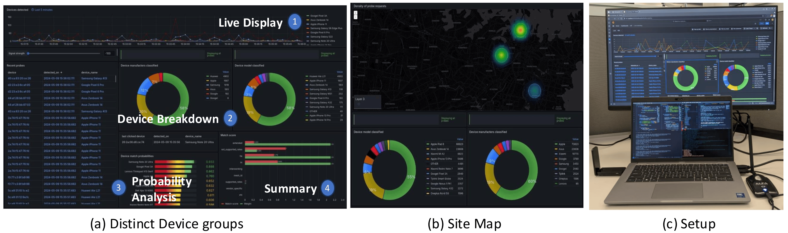

## Overview
We developed a **Grafana**-based real-time monitoring dashboard for intuitive device monitoring and analysis. This tool leverages our signature-based method from the paper *[Passive Identification of WiFi Devices At-Scale: A Data-Driven Approach](https://ieeexplore.ieee.org/abstract/document/10639764)*, which provides a passive identification approach to monitor WiFi devices in real-time.

The **Landing Page** serves as the central hub for monitoring and categorizing incoming probe requests. It consists of the following key components:
- **Live Feed Display**: A dynamic, real-time view of incoming probes, categorized by device type.
- **Device Breakdown Panel**: Detailed information about detected devices, including features and characteristics from the database.
- **Probability Analysis**: Transparent breakdown of how each probe resembles specific devices, showing classification probabilities.
- **Probe Calculation Summary**: A panel detailing the categorization process behind the probe frames.

The **Interactive Map** visualizes probe data across multiple sites and includes:
- **Site-Specific Device Breakdown**: View device breakdowns for individual sites.
- **Customizable Filtering Options**: Adjust the map view based on vendor, device model, and other criteria.
- **Cross-Site Comparisons**: Track devices across different sites using MAC addresses to identify patterns in device mobility or reuse.



## Instructions for Execution

### Setup

1. **Populate Data**:
   - Add required JSON data files for creating PostgreSQL tables and prediction bases into the `scripts/db` folder.

2. **Generate SQL File**:
   - Run the following command to generate the SQL file:
     ```bash
     python3 scripts/generate_sql.py > setup.sql
     ```
   - Move the generated SQL file into the `db_setup` folder. Ensure all `.sql` files in this folder will be executed during initialization (only when the PostgreSQL database hasn’t been initialized).

3. **Ensure Pcap File Setup**:
   - Add new `.pcap` files to any folder inside `wild_data`. For example:
     ```
     wild_data/folder_1/capture_1.pcap
     ```
     - Files must be placed inside subfolders (e.g., `folder_1`), and their paths must be unique.

4. **Compose Containers**:
   - Build and start containers using Docker Compose:
     ```bash
     sudo docker compose up --build -d
     ```

5. **Access the Dashboard**:
   - Visit the Grafana dashboard at `https://127.0.0.1:3000` and log in using:
     - **Username**: admin
     - **Password**: admin

6. **Reset Database**:
   - To delete all data from the database, use the `reset_data.sh` script. After resetting, the data container may fail to start, so run:
     ```bash
     sudo docker start data
     ```

### Additional Scripts
- **`scripts/generate_sql.py`**: Generates the `init.sql` file, reads command-line arguments for JSON files, creates tables, and populates the device map.
- **`scripts/generate_data.py/predict_signatures`**: Used for data prediction and uploading to the database.

### Important Notes
- Be sure to replace the old SQL file in `db_setup/setup.sql` with the newly generated one. Delete the old database to ensure changes are applied.
- Ensure the file paths for `.pcap` are unique and correctly structured to avoid reprocessing the same data.

## Citation

To cite the method and the tool, refer to the following paper:

1. Bogahawatta, N., Karunanayaka, Y. S., Seneviratne, S., Thilakarathna, K., Masood, R., Kanhere, S., & Seneviratne, A. (2024, October). *Passive Identification of WiFi Devices At-Scale: A Data-Driven Approach*. In *2024 IEEE 49th Conference on Local Computer Networks (LCN)* (pp. 1-9). IEEE.  
   
   BibTeX:
   ```bibtex
   @inproceedings{bogahawatta2024passive,
     title={Passive Identification of WiFi Devices At-Scale: A Data-Driven Approach},
     author={Bogahawatta, Niruth and Karunanayaka, Yasiru Senarath and Seneviratne, Suranga and Thilakarathna, Kanchana and Masood, Rahat and Kanhere, Salil and Seneviratne, Aruna},
     booktitle={2024 IEEE 49th Conference on Local Computer Networks (LCN)},
     pages={1--9},
     year={2024},
     organization={IEEE}
   }
   
2. Bogahawatta, N., How, G., Karunanayake, Y., Seneviratne, S., Thilakarathna, K., Kanhere, S., Masood, R., & Seneviratne, A. (2024). Passive Identification of WiFi Devices in Real-Time. In Proceedings of the ACM SIGCOMM 2024 Conference: Posters and Demos (pp. 92-94).

   BibTeX:
   ```bibtex
   @inproceedings{bogahawatta2024passive2,
     title={Passive Identification of WiFi Devices in Real-Time},
     author={Bogahawatta, Niruth and How, Gerry and Karunanayake, Yasiru and Seneviratne, Suranga and Thilakarathna, Kanchana and Kanhere, Salil and Masood, Rahat and Seneviratne, Aruna},
     booktitle={Proceedings of the ACM SIGCOMM 2024 Conference: Posters and Demos},
     pages={92--94},
     year={2024}
   }

